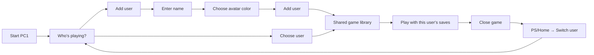

# Console users

PC1 now opens **Who's playing?** at startup. Choose a user to enter the shared
library, or choose **Add user**, enter a name with the controller keyboard,
choose an avatar color, and select **Add user**. The new user becomes active.
Up to eight local users are supported. The original user can be renamed with
**Edit current user**; existing saves remain with that original user.

After startup, press PS/Home and choose **Switch user**, or open
**Settings → Users**. Close games and apps, including minimized ones, and finish
installation before switching. The picker explains any blocker. Back cancels
adding a user or returns to the library from Switch user; startup requires a
selection. New users have permanent IDs, so renaming never changes save ownership.




## Shared and personal data

| Shared across users | Personal to each user |
|---|---|
| Installed games, application binaries and artwork | Managed Windows apps' standard save folders and user registry |
| Common library and download/install queue | Play history, recent-game ordering and achievement cache |
| Steam account, remembered login, userdata and Steam game saves | HOME/XDG directories for shell-launched games outside Steam |
| Operating system and device settings | Browser bookmarks and browsing-history list |
| The Linux `player` account and Chromium website sign-ins/cookies | |

Users live in `~/.local/share/marwanos/profiles/users.json`. Personal data lives
under `profiles/<permanent-id>/`. The original user's shell history, achievement
cache and browser library retain their legacy paths. The old `profile-name`
becomes the original user's display name on first migration.

`profiles.py` redirects managed Windows apps' Wine/Proton `drive_c/users` and
`user.reg` into personal storage. Existing data is moved into the original user's
store, never copied into new users. Steam's userdata, Proton prefixes and native
game HOME remain shared and are not redirected on user selection. Game binaries
stay in place. A persistent binding record accounts for Wine replacing
`user.reg` during registry commits.
Interrupted migrations can be retried, and unexpected links or conflicting
legacy/archive files cause an error instead of being overwritten.

Switching hides the Steam pane while keeping the client and its remembered
login running. Local users are not linked to Steam accounts: choosing a user
does not sign in, sign out, restart Steam or change its account. Switching rebinds
managed Windows save locations, then atomically commits the selected user. A
failed commit restores the previous bindings. Achievement polling shares the save-switch lock
and checks the selected user before reading progress. Browser tabs close on a
switch; each user's bookmarks/history reload when Browser opens again.

On systems that ran the earlier profile implementation, existing Steam save
links retain their current targets and become shared across local users. Other
profile archives remain on disk; switching does not merge or delete them.

## Compatibility limits

- Steam games and Steam Cloud follow the shared Steam account. Local user
  selection does not provide separate Steam saves or accounts. Both native
  Steam and the legacy Flatpak fallback use this shared session.
- Games saving beside their executable, in shared ProgramData, or in other
  custom paths need game-specific handling. Those locations currently remain
  shared; Add user explains this limit. Games installed inside `drive_c/users`
  must be reinstalled into `C:\Games` to share their binaries with another user.
- Local profiles share a Linux uid. They separate supported game data, but are
  not protected OS accounts. Files, browser website sessions and machine settings
  remain shared. No PIN or parental controls are included.
- Removing an app removes its common installation for everyone. Profile save
  archives remain in storage; reinstalling to a different prefix does not
  automatically reconnect those archives.

## Verification

The shared-Steam revision passes 14 Linux profile and four Steam backend tests,
plus the six Godot suites for profiles, Home design, play history, achievements,
console refinement and Browser. Checks cover leaving Steam's client and login
intact, preserving shared Steam/Proton saves, retaining native and Flatpak launch
support, and blocking a switch during a running Steam game. This revision is
source-verified and has not been deployed to PC1 or baked into an OS image.

The initial 2026-10-10 deployment passed 14 Linux profile regressions, including
two users launching
the same executable through the real managed-app helper, registry replacement,
legacy-save preservation, external Steam libraries, invalid paths, migration
recovery and failed-switch rollback. Three Steam and 28 achievement backend
regressions also pass. The existing local-installer suite passes 32/36 tests in
the isolated WSL runtime; four guided-display tests fail because `Xvfb` is absent.

Godot 4.7.1 passes the profile, shared Home design, play-history, achievements,
console-refinement and browser-shell suites. Profile checks cover adding,
renaming, persistent selection, separate history, minimized-game blocking,
keyboard cancellation, Home and Settings navigation, and layouts at 900, 1920 and 2580 px.
The picker is rendered and inspected on Windows. This is source/fixture
validation; native Steam, real Proton registry behavior and save/restore across
two users still need acceptance with actual games on PC1. The reversible bench
deployment below uses the verified source; an OS image was not rebuilt.

## Bench deployment — 2026-10-10

Deployed to PC1 at `192.168.50.206` at 10:20 UTC. The startup picker was inspected
on its 3440×1440 display, and selecting the existing **Marwan** user returned to
the shared library. The Home system menu includes the user icon, and
**Settings → Users** opens the same switch/add/edit picker. Both entry points
pass the Linux shell regression suite. The explanatory picker footer remains
removed.


The build starts from the source archive matching the active bench shell and
preserves the current native browser engine, game cards, Files, Downloads,
keyboard and controller fixes. Four existing launch/achievement helpers are
overridden by the enabled, image-guarded `marwanos-user-profiles.service`.
`MARWANOS_PROFILES_HELPER` points the shell and relevant services at
`/var/marwanos/user-profiles-20261010/profiles.py`, allowing the new helper to run
without modifying the immutable image.

All six shell suites and 45 backend tests passed on the bench with isolated
data. Exported startup also passed as `player` before activation. The live shell,
Windows worker and achievement service are active; seven owner-save bindings
were established during initial selection. Actual game save/restore across two
users and reboot validation remain pending.

Active shell: `/var/marwanos/console-design-20261009/marwanos-shell`.
SHA-256: `8fae6b37056ae1a7041f24fb710f76d48f55ee8b0aabb17de291df23525fc58a`.
Source: `/var/tmp/pc1-user-profiles-20261010/source.tar.gz`.
Deployment manifest: `/var/marwanos/user-profiles-20261010/deployment.json`.
Local build scripts and evidence are under `out/profiles-bench-20261010/`.

Rollback copies are `marwanos-shell.before-user-profiles-20261010` beside the
active shell and `/var/marwanos/user-profiles-20261010/backup/wrapper`.
Select the original user and close games/installers before rollback. Disable
and stop `marwanos-user-profiles.service`, restore the saved wrapper in place
and the saved binary through a separate replacement inode, and remove the
`60-user-profiles.conf` drop-ins for the Windows and achievement services.
Reload their systemd managers and restart those services and the supervised
shell. Keep the profile store: its save archives remain the targets of the
restored original user's save links. No reboot or OS/driver replacement was
performed during deployment.

```bash
python3 -m unittest discover -s tests -p test_profiles.py -v
GODOT_BIN=/path/to/godot bash scripts/check-profiles-shell.sh
```

Windows shell verification and screenshot capture:

```powershell
./scripts/check-profiles-local.ps1 -Capture -GodotBin /path/to/Godot_v4.7.1-stable_win64_console.exe
```

Fixture overrides are `MARWANOS_PROFILES_HOME`, `MARWANOS_HISTORY_HOME` and
`MARWANOS_ACHIEVEMENTS_HOME`. `MARWANOS_SHELL_WINDOWED` suppresses the startup
picker for development and existing headless suites. `MARWANOS_PROFILE_ID`
passes the selected permanent user ID to game helpers.
